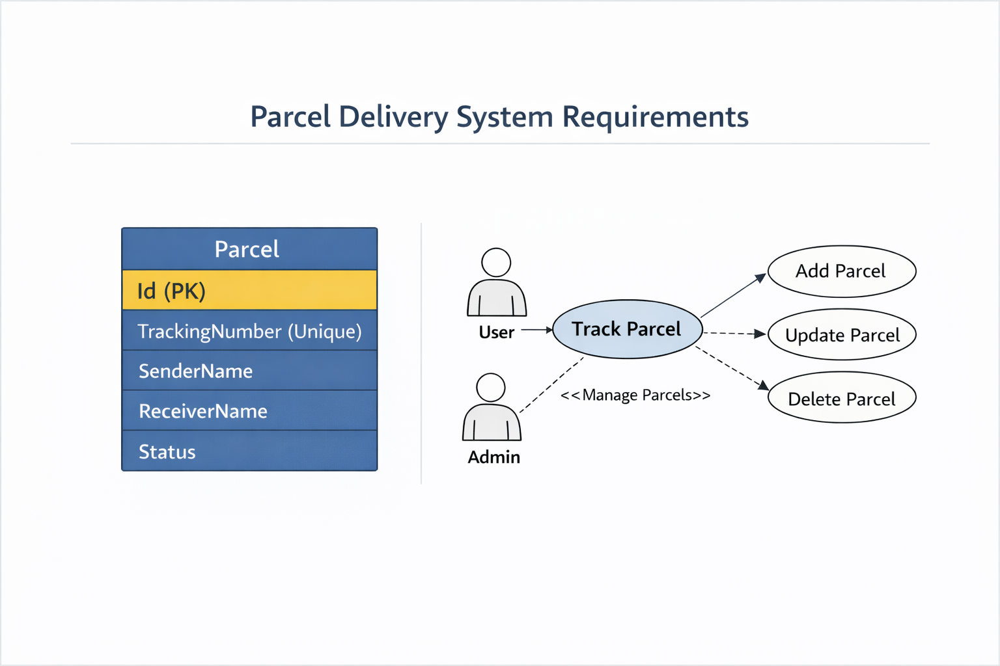

# Parcel Delivery System Requirements

## 1. Purpose
The Parcel Delivery System allows users to track parcels by their unique tracking numbers. Admins can manage parcel records.

## 2. Functional Requirements
- Users can enter a tracking number to view parcel details.
- System displays:
  - Tracking Number
  - Sender Name
  - Receiver Name
  - Status
- Admin can add, update, or delete parcel records.
- System ensures each parcel has a **unique tracking number**.

## 3. Non-Functional Requirements
- **Performance**: Track parcels quickly, response within 1 second.
- **Security**: Prevent unauthorized modifications.
- **Scalability**: Able to handle thousands of parcels.
- **Reliability**: Data should persist correctly using a database.

## 4. Constraints
- Built using ASP.NET Core MVC and Entity Framework Core.
- Database: SQL Server or SQLite for development.

## 5. ERD Diagram

This diagram shows the Parcel entity with its fields and relationships.